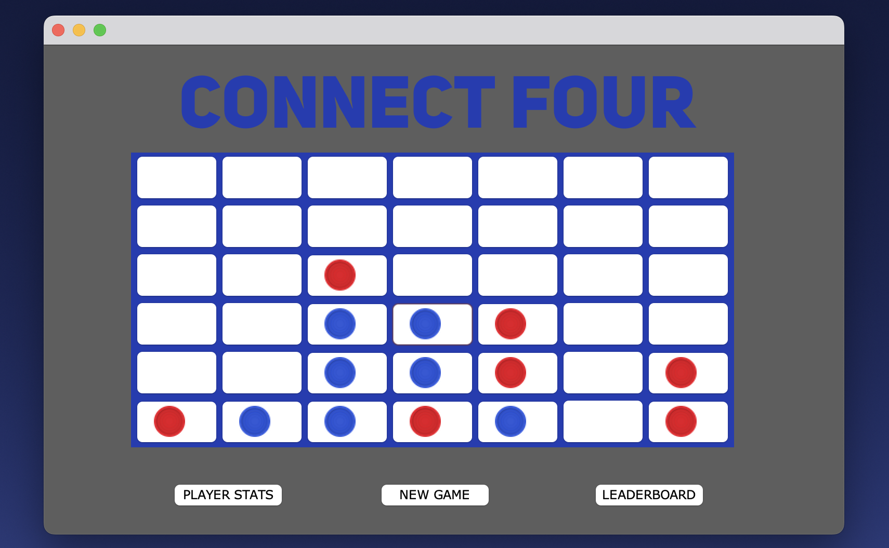

# Connect Four

This is a final project for an Algorithms and Data Structures course. It is an implementation of the traditional Connect 4 game against a computer.

---

## Features

The AI agent was implemented with a graph that is used to store generated game states (5 moves into the future) which are then searched to find winning game conditions. The agent uses a mediocre decision-making algorithm, moving "toward" a random "nearest" winning game condition unless the human player is about to make a winning move, in which case the agent attempts to block the human. This is not an optimal algorithm and results in gameplay about as challenging as playing an average human.

  

### Planned
- Addition of two other levels of play difficulty.
- Fix the issues with the GUI. (see below)
- Create an API for integrating user-supplied agents.
- Support for human v. human and AI v. AI gameplay.

---

## Development Status

### Known Issues
- Sometimes the player tokens fail to show immediately.

---

## Project Info

**Status:** Alpha (fairly stable)  
**Authors:** K. Griffin (GitHub: [KGriffin90](https://github.com/KGriffin90)) and T. Stratton  
**Start Date:** 15-NOV-2023  
**License:** MIT License – see [LICENSE](./LICENSE)  
**Language:** Java 11.0+ (tested on 11.0)  
**Topics:** game, connect-4, ai